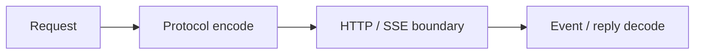

# llm4cj

[](https://github.com/lIlIIlIll/llm4cj/actions/workflows/ci.yml)
[](https://codecov.io/gh/lIlIIlIll/llm4cj)
[](https://github.com/lIlIIlIll/llm4cj/releases)
[](https://cangjie-lang.cn/)
[](LICENSE)

`llm4cj` 是面向仓颉的、提供方中立的 LLM wire codec 与有界流式传输基础库。它把统一请求编码为 `Responses`、`ChatCompletions` 或 `Messages` wire format，并把固定响应或 SSE 事件还原为统一对象。

它不是完整的 LLM SDK：不管理 API key、endpoint、model catalog、HTTP client、retry policy 或 agent loop。应用负责网络与策略，`llm4cj` 负责协议边界。

## 快速开始

稳定使用者应依赖 `v0.1.0`；`main` 是开发分支。

```toml
[dependencies]
llm4cj = { git = "https://github.com/lIlIIlIll/llm4cj.git", tag = "v0.1.0" }
```

下面的完整程序不访问网络。它构造 `Responses` 请求、编码 JSON、解码固定响应并打印文本。

```cj
package llm4cj_external_consumer

import llm4cj.*

main(): Int64 {
    let request = LlmWireRequest(
        "demo-model",
        [LlmWireMessage(
            LlmWireRole.User,
            [LlmWireBlock(LlmWireBlockKind.Text, text: "你好")]
        )]
    )
    let payload = encodeLlmWireRequest(LlmWireProtocol.Responses, request)
    if (!payload.contains("demo-model")) { return 1 }

    let reply = decodeLlmWireReply(
        LlmWireProtocol.Responses,
        "{\"id\":\"resp_demo\",\"status\":\"completed\",\"output\":[{\"type\":\"message\",\"content\":[{\"type\":\"output_text\",\"text\":\"你好，仓颉！\"}]}],\"usage\":{}}"
    )
    for (block in reply.blocks) {
        if (let LlmWireBlockKind.Text <- block.kind) { println(block.text) }
    }
    0
}
```

运行结果：

```text
你好，仓颉！
```

## 选择协议

新集成默认从 `Responses` 开始。只有目标 endpoint 明确要求 OpenAI-compatible Chat Completions 或 Anthropic-compatible Messages 时，才选择对应协议。DeepSeek 的已验证差异通过专用 encoder 显式表达，不靠 provider 名称猜测。

| 目标 wire format | 请求编码 | 响应解码 |
| --- | --- | --- |
| Responses | `encodeResponsesWireRequest` | `decodeResponsesWireReply` |
| Chat Completions | `encodeChatCompletionsWireRequest` | `decodeChatCompletionsWireReply` |
| Messages | `encodeMessagesWireRequest` | `decodeMessagesWireReply` |

统一入口是 `encodeLlmWireRequest`、`decodeLlmWireReply` 和 `decodeLlmWireEventStream`。详见[协议选择](docs/choosing-a-protocol.md)。

## 能力边界

- 统一表示文本、图片、推理、tool call、tool result、refusal 和错误块。
- 编码 tool、structured output、thinking、cache、service tier 与流式请求选项。
- 解码完整 reply、低延迟单帧事件和带终止证据的完整 SSE stream。
- 增量解析 SSE，并对事件、缓冲区与 HTTP body 设置明确上限。
- 将 provider、HTTP、SSE、deadline、cancel 与 wire failure 归一为 `LlmTransportError`。



## 文档

- [文档导航](docs/README.md)
- [安装与首个程序](docs/getting-started.md)
- [请求与响应](docs/requests-and-replies.md)
- [流式与传输](docs/streaming-and-transport.md)
- [Tools、thinking 与 structured output](docs/tools-thinking-and-structured-output.md)
- [错误与限制](docs/errors-and-limits.md)
- [API reference](docs/api-reference.md)
- [架构](docs/architecture.md)
- [测试与发布](docs/testing-and-releasing.md)

## 版本与平台

manifest 要求 Cangjie `>= 1.1.0`。当前持续验证环境是 Linux x64；其他平台尚无持续验证承诺。`0.x` 期间不承诺跨 minor 兼容，patch 版本尽力保持兼容；public API、默认值、协议行为和错误码变化记录在 [CHANGELOG](CHANGELOG.md)。

贡献前运行 `scripts/check.sh`。安全问题请按 [SECURITY.md](SECURITY.md) 私下报告。项目使用 [Apache-2.0](LICENSE) 许可证。
