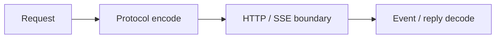

# 架构

`wire.cj` 定义 provider-neutral model、三个协议的 encoder/decoder、stream event projection 与 terminal reconstruction。`json_support.cj` 提供保留 number literal、拒绝 duplicate key 的有界 JSON bridge。`transport.cj` 提供 SSE framing、Retry-After parsing、bounded body read 和统一 error/result。

应用拥有 HTTP client、credential、endpoint、model selection、retry/backoff、deadline source、tool execution 与 agent loop。该边界让 codec 可离线测试，并避免把 provider policy 隐式固化到基础库。

低延迟路径使用 `decodeLlmWireEventFrame`；完成性路径使用 `decodeLlmWireEventStream`。二者共享事件类型，但只有后者维护跨 frame 状态和 terminal evidence。

0.x 期间允许 minor 版本调整 public API。任何 public surface、默认值、协议 mapping 或错误码变化都应进入 CHANGELOG，并由 external consumer 验证安装边界。
